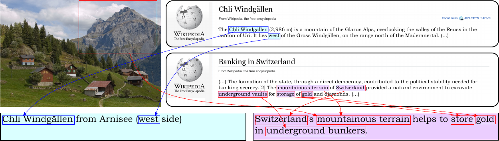

# Wikipedia Captioning

Code for the AAAI 2023 paper: "[Show, Interpret and Tell: Entity-aware Contextualised Image Captioning in Wikipedia](https://arxiv.org/abs/2209.10474)"

---
<p align="center">
  
</p>

The structure of this repo is as follows:

1. Environment setup 
2. Data pre-processing 
3. How to train/evaluate models

## Set-up environment
This code works in our environment with CUDA 11.4 and NVIDIA A40 GPUs
First, to install all the dependencies from environment.yml:

```bash
conda env create -f environment.yml
spacy download en_core_web_sm

```

To run experiment with GPT-2++ and T5++, you need to install the transformers version added as submodule, which contains with some modifications in the GPT2 adn T5 classes to enable the models to work with images.
```bash
cd transformers
pip install -e .
```

## WIT dataset
The dataset that we use in the paper is built upon WIT dataset (refer to the original [repository](https://github.com/google-research-datasets/wit) for instructions of downloading the data). While the dataset is multilingual, we primarily focus on its English subset, even though there is no constraints to extend our work to other languages. 

To preprocess and clean WIT data for Wikipedia Captioning task:
```bash
python utils/preprocess.py --dset wit/goodnews --data_dir /path/to/original/data/ --save_dir /path/to/save/data/
```
If you want to directly start working on the same dataset as ours, please download the data split from [here](https://cvcuab-my.sharepoint.com/:f:/g/personal/knguyen_cvc_uab_cat/Er_nNnUqoidBk2ETpLO0AI0BVYYC6vAx3xO8fnAL6-LtrA?e=pqxpAy), which is already cleaned and pre-processed.

## Train/Evaluate
TODO